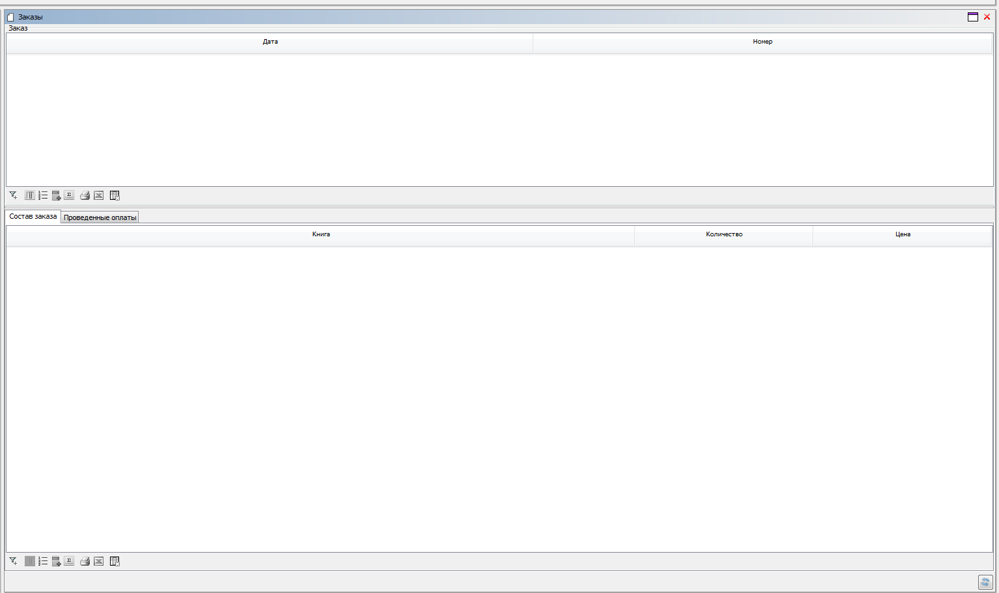
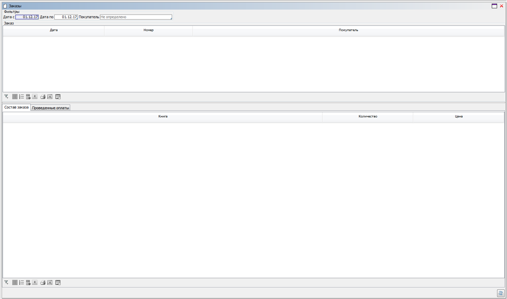

##### Example 1

###### Condition

We have a form with the list of orders, where each order is associated with a list of books and its posted payments.

We need to customize the design of the form, so that the lines and payments can be displayed on dedicated tabs which are separated from the list of orders using a vertical splitter.

###### Solution

The form will look like this:

##### Example 2

###### Condition

Similar to Example 1, except we have added filters by date and customer to the form.

We need to add filtering elements to the design of the previously created form.

###### Solution

Result:

