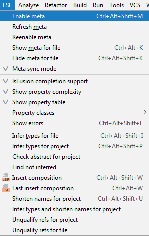
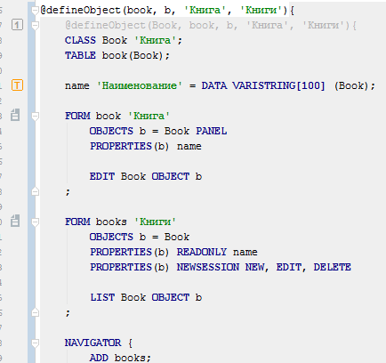

You may often need to write "similar" code for certain cases. The [META instruction](META_instruction.md) exists for this purpose, and makes it possible to create a code template or *metacode*. It can contain parameters that will be replaced by certain values when this metacode is used. Such an approach is called [metaprogramming](Metaprogramming.md).

Let's create a simple directory as described in the article .[How-to: CRUD](How-to_CRUD.md).

We can use this code to write the following metacode:

Note that one code segment can programmatically call another one.

This is how metacode is used:

In the first case, when the system starts generating the result code, it will replace all **id** lexemes with *book*, **shortId** with *b*, **caption** with *'Book'*, and **multiCaption** with *'Books'*. When using \#\# concatenation, these replacements will leave everything unchanged. If \#\#\# concatenation is used, the first letter of the value will be capitalized. The generated code will look like this:

In order for the IDE to "see" the code generated by metacodes, you need to enabled the corresponding mode in the menu.

When the metacode support mode is enabled, the generated code will be automatically substituted in the source code if metacode is used.

Any modifications of the code will be impossible, since they will be automatically overwritten by the IDE. However, it is recommended to disable this mode when committing code to your version control system to avoid creating redundant change history entries.

Objects created using metacode can subsequently be extended using standard [mechanisms](How-to_Extensions.md).

