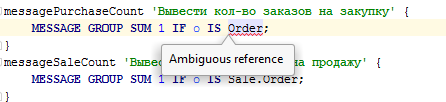

Occasionally, you will find yourself in situations where you will need to use the same [name](Naming.md) for different system elements. For this purpose, you can assign them to different namespaces that are defined for a module using the [NAMESPACE](Module_header.md) instruction. By default, the namespace matches the name of the module.

Let's create two modules, **UseCaseNamePurchase** and **UseCaseNameSale**, that declare the logic of purchase and sell orders :

Both of them have the **Order** class declared in them, but since the modules have different namespaces, the first one's will be **Purchase**, the second one's will be **Sale**.

Let's declare a test module with a **Test** namespace that will simultaneously depend on both modules:

If you try to refer to the **Order** class without explicitly specifying the namespace, you will see an error message:

All such references require an explicit specification of the namespace.

In case the namespace of a module matches the space of the required system element (for example, **Purchase**)

or the namespace priority has not been specified using the [PRIORITY](Module_header.md) instruction,

you can skip the specification of the namespace

If you don't specify the namespace, the class from **Purchase** will be used. You still can explicitly specify the namespace (for example, **Sale**).
