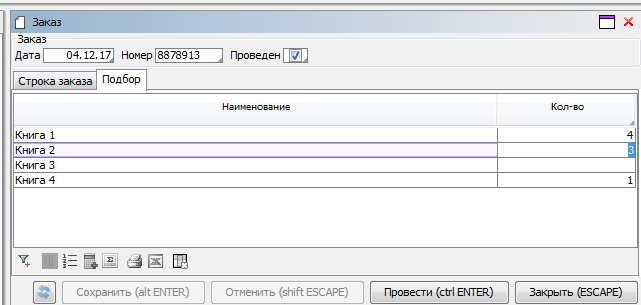

##### Posting documents

###### Condition

There is some logic for working with orders.

import {CodeSample} from './CodeSample.mdx'

<CodeSample url="http://documentation.lsfusion.org:5000/sample?file=UseCaseDocument&block=sample1"/>

An order edit form has been created for orders.

<CodeSample url="http://documentation.lsfusion.org:5000/sample?file=UseCaseDocument&block=solution1"/>

Besides, a **"Posted"** property has been added for orders. In the future, only orders with this property will take part in subsequent calculations (for example, calculation of the reserved quantity).

<CodeSample url="http://documentation.lsfusion.org:5000/sample?file=UseCaseDocument&block=sample3"/>

We need to do so that instead of the **ОК** button on the order form, there is a **Post** button that simultaneously sets the **Posted** property for the order, saves changes, and closes the form.

###### Solution

<CodeSample url="http://documentation.lsfusion.org:5000/sample?file=UseCaseDocument&block=solution3"/>

Each time the renamed **OK** button is pressed, the **post** action will be executed in a single transaction. With this scheme, if the user wants to "post" a document, they just need to go to the edit form, uncheck the **Posted** box in the document header, then click **Save** and **Close**.

##### Line selection

###### Condition

We have an order with an edit form similar to the **Posting documents** example.

We need to add a possibility to enter order lines by specifying the quantify in the table containing the list of products. Any changes in order lines and this table should be automatically synchronized with each other.

###### Solution

<CodeSample url="http://documentation.lsfusion.org:5000/sample?file=UseCaseDocument&block=solution4"/>

The form will look like this:

If the quantity changes on the **Selection** tab, the system will automatically change order lines. If the order lines are changed, the quantity on the **Selection** tab will change as well.

If an order has two or more lines with one book, the system will reset the quantity in the first lines and set the total in the last line. If you want the change to affect the last line only, you need to use the following action during saving:

<CodeSample url="http://documentation.lsfusion.org:5000/sample?file=UseCaseDocument&block=solution4a"/>

However, users may not understand this behavior, since after they enter a particular quantity on the **Selection** tab, the total quantity for all lines will be shown in the same column and it will be different from the entered value.

##### Aggregated documents

###### Condition

We have the order logic.

We need to add some invoicing logic so that an order could automatically create a corresponding invoice.

###### Solution

In order to implement this logic, you need to create an abstract **Invoice** [class](Classes.md) with the necessary set of [abstract properties](Property_extension.md).

<CodeSample url="http://documentation.lsfusion.org:5000/sample?file=UseCaseDocument&block=solution5a"/>

A form containing the list of objects of this abstract class is also created. It will contain the objects of all classes inherited from the **Invoice** class.

<CodeSample url="http://documentation.lsfusion.org:5000/sample?file=UseCaseDocument&block=solution5b"/>

The **edit** property will call the current object's edit form defined for its class. If it's not defined for the current object's class, no action will be taken. The **DELETE** property will delete the current object if it doesn't violate any constrains.

An object of an abstract class cannot exist in the system. In order for the user to manually create an invoice, a separate class **UserInvoice** is created . Also, it requires the creation of properties symmetrical to the abstract ones that are later added as their implementation.

<CodeSample url="http://documentation.lsfusion.org:5000/sample?file=UseCaseDocument&block=solution5c"/>

Let's create a form for editing a user-generated invoice. Let's add a button for adding a user-generated invoice to the form with a list of abstract invoices.

<CodeSample url="http://documentation.lsfusion.org:5000/sample?file=UseCaseDocument&block=solution5d"/>

For orders, let's create a **createInvoice** option that will be used for generating an invoice. We will now need to create a **OrderInvoice** class that will be inherited from **Invoice**. An object of this class will be automatically created and deleted by the system for every order with the **createInvoice** option. Therefore, this invoice is an [aggregated object](Aggregations.md) for the corresponding order. Aggregation for the invoice line relative to the order line is created identically.

<CodeSample url="http://documentation.lsfusion.org:5000/sample?file=UseCaseDocument&block=solution5e"/>

We specify that an attempt to edit such an aggregated invoice will have to open the edit form for the associated order.

<CodeSample url="http://documentation.lsfusion.org:5000/sample?file=UseCaseDocument&block=solution5f"/>

When you try to delete an invoice created for an order, you will see an error message.

The fundamental difference between this aggregation approach and one based on generating an invoice against an order is that the system automatically ensures synchronization between orders and invoices. When creating order-based invoices, the user has to manually modify them if corresponding orders are changed. Otherwise, it will require a separate event handling mechanism that will be responsible for it.
