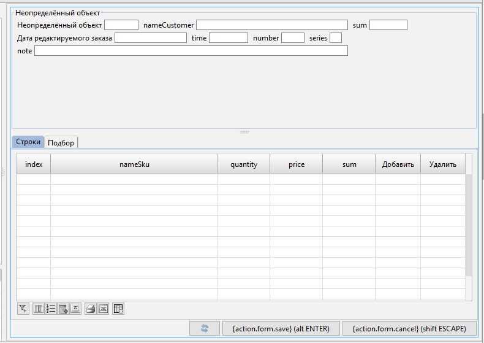

# lsFusionForm design

# Form design

The *form design* defines how a [form](Forms.md) is displayed in the [interactive](Interactive_view.md) view.

As with any GUI, form design is a hierarchy whose nodes are *components*. Components, in turn, can be:

-   *containers*: components that contain other components.
-   *base components*: graphical vews of the elements described in the [form structure](Form_structure.md) and the form[interactive view](Interactive_view.md).

Each component must have its own unique name within *the form*. 

**Containers**

All children of any container make an ordered list. It is necessary to determine how the child components of each container on the form should be placed. To do this, one of the following *types* can be specified for a container:

-   *Vertical container* (**CONTAINERV**): children are placed from top to bottom.
-   *Horizontal container* (**CONTAINERH**): children are placed from left to right.
-   *Tabbed panel* (**TABBED**): at any given time exactly one child component is shown. This component is determined by user via selecting the corresponding tab.
-   *Column container* (**COLUMNS**): components are placed in a fixed number of columns. When a child component is added, it is placed in the first column with the minimum number of components. In fact, columns are filled first from left to right and then, when the number of columns reaches the specified one, a new row begins, which is located relative to the previous ones from top to bottom; the layout then goes again from left to right and so on. 
-   *Vertical splitter* (**SPLITV**): can be used only if the container has exactly two child components. In this case they are arranged from top to bottom, and the user can change how much space is given to each of them.
-   *Horizontal splitter* (**SPLITH**): similar to a vertical splitter, but the child components are placed from left to right.
-   *Scrollable container* (**SCROLL**): can be used only if the container has exactly one child component. This single component occupies all the space it needs in the container, and if there is not enough a scroll bar appears.

In future versions, the last three types of containers (**SPLITV**, **SPLITH**, **SCROLL**) will be deprecated and [replaced](https://github.com/lsfusion/platform/issues/22) with the corresponding split and scroll options in vertical and horizontal containers.

The default container type is vertical container (CONTAINERV)*.*

If at some point a container has no child components , or they are invisible, it is automatically hidden. In turn, if a component is not a child of any container, then it will not be shown on the form.

**Base components**

When defining the form design, the developer can use the following base components, which are created automatically based on the form structure:

*Object groups / trees*:

-   *Table/Tree* (**GRID**): a component consisting of rows and columns in which the rows correspond to object collections of the corresponding [group of objects](Form_structure.md) and columns correspond to [properties](Properties.md) and [actions](Actions.md).
-   *System toolbar* (**TOOLBARSYSTEM**): a panel consisting of buttons with which the user can execute various system actions on the rows in the table. Automatically hidden if the table becomes invisible.
-   *User filter* (**USERFILTER**): a component with which the user can create and apply their own filters to a table.

*Filter groups*

-   *Filter group* (**FILTERGROUP**): a component with which the user can activate the filters they need in a form's [filter groups](Interactive-view_1573071.html#Interactiveview-filtergroup).

*Properties / Actions*

-   *Property panel* (**PROPERTY**): a component that displays the title and current value of a property. The caption can be either to the left of the value cell or at the top. Not shown if the property is displayed in the table.

**Dimensions and components layout**

The developer can control how the platform distributes the available container sizes between its internal components, as well as how these components will be located relative to each other.

First of all, for each component you can specify the *base* size that this component will receive in any case, regardless of the algorithm for placing its container.

To determine the final size of the components and their location inside the container, the following algorithm is used:

For each container, one of the directions is considered to be *dynamic*, and the other *static*. The dynamic direction is determined from the name of the container, for example, for a vertical container, the dynamic direction will be vertical; for a horizontal splitter it will be horizontal. For a columned or scrollable container, as well as a tab panel, the dynamic direction is considered to be the vertical. Further, depending on the direction:

-   Dynamic: all components are placed one after another, in the order they are added to the container. Also, *extension coefficient* (**flex**) can be specified for each component. In this case, the space remaining in the container (that is, minus the basic dimensions of all internal components) is divided between all components in proportion to their extension coefficients.

-   Static: *alignment* can be specified for each component (**alignment**). Its values can be *At the start* (**START**), *Center* (**CENTER**), *At the end* (**END**), or *Stretch* (**STRETCH**). In the first three cases, the component gets its base size as the final size, and is positioned in accordance with the specified type of alignment (that is, at the beginning, center, or end). If Stretch is used as the type of alignment, the final size of the component will be the size of the top container (but not less than the base size), and it will be located exactly in the center. 

    For example, in the case of a vertical upper container, if the component is set to align at the start then it will be located on the maximum left of the container; if it is set to Stretch, the component will occupy all the space from the left to the right border.

This component layout algorithm is a special case of [CSS Flexible Box Layout](https://www.w3.org/TR/css-flexbox-1/) (and is implemented using it in the web client). For example, the CSS flex-grow property corresponds to the extension coefficient, and flex-basis corresponds to the base size.

The column container breaks its static (horizontal) direction into **N** identical parts (where **N** is the number of columns): each part then has its own components, as if this part were a separate vertical container.

For base components, you can specify the *automatic size* option (**autoSize**): in this case, the base size will change automatically in to enclose exactly the entire contents of this base component (for example, for a table: all its records plus a title).

The properties layout in a table (or rather, the columns that display their values) is done the same way as if the table were a horizontal container, and the columns of the table were internal components of this container. 

Since the current implementation uses the [CSS Table Layout Fixed](https://www.w3schools.com/cssref/pr_tab_table-layout.asp) mechanism to place columns inside the table in the Web client, and its capabilities are significantly limited, the extension coefficient for properties displayed in the table can be equal either to 0 or to the base size.

The caption and the value cell are placed inside the property panel in the same way as if the panel were a container (horizontal if the caption is on the left, vertical if at the top), in which the cell has an extension coefficient of 1, the caption is 0 and the alignment of both is set to  STRETCH 

*Property value cell sizes*

When displaying properties, you can explicitly specify dimensions of the entire container (together with the caption, if the property is in a panel) and also the dimensions of the *value cell* itself. To do this, add the prefix **value** to the size name, e.g. **valueWidth**). Also, it is worth noting that these dimensions (those of the value cells, and not the entire container) are also used to determine the column widths if the property is displayed in a table.

For property value cells, it is also possible to specify the base width not in pixels, but using a *sample value* (**widthValue**) In this case, the platform takes into account the user's font/mask/locale to calculate and set the width in pixels so that the user can see exactly the specified sample value (no more, no less). It is assumed that the sample value must be either a string or of a class equal to the class of the property value.

In addition, cell widths can be specified in *characters* (**charWidth** ), which is equivalent to giving a string sample value consisting of the given number of zeros.

In the last two cases (that is, when specifying the width as a sample value or in characters), if the property value class implies the presence of buttons on the right during [input](Primitive_input_INPUT_.md) (for example, **DATE** class), then the width of this button (21 pixels) is added to the width of the property value cell.

**Default dimensions and layout**

By default, the extension coefficient and alignment for components are determined as follows:

The output is the following form:

