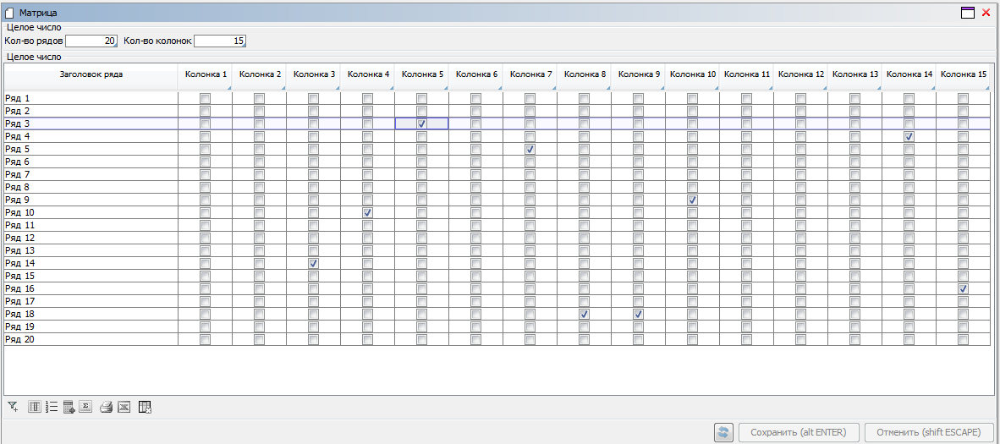

# lsFusionHow-to: Matrix

# How-to: Matrix

##### Example 1

###### Condition

We have the concepts of books and buyers defined. A price is defined for each book and buyer.

In real projects, we recommend limiting the number of rows and columns during data entry or filtering. Otherwise, if the user enters too many rows or columns, the system will generate a CTE query for the **iterate** property which, in turn, will produce a table containing entered (very big) number of records and that may cause the server database to crash.

Result:

