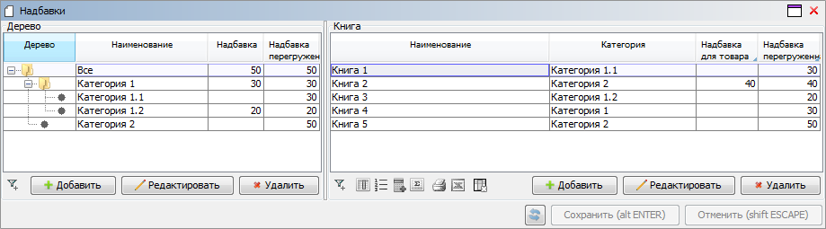

# lsFusionHow-to: Overriding values

# How-to: Overriding values

Often there are tasks when it is necessary to give the user opportunity to enter the value of some attribute for some general object and then override it for some specific object.

Let's take a look when you need to define a trade mark-up for a book. At the same time, we have the logic of categories defined. These categories form a tree by specifying a parent for each category. The user should be able to set a mark-up for any produсt and category at any level.

Let's define the logic of categories and the [data property](Data_properties_DATA_.md) of this category's markup.

As a result, the form with the filled data will look like this:

