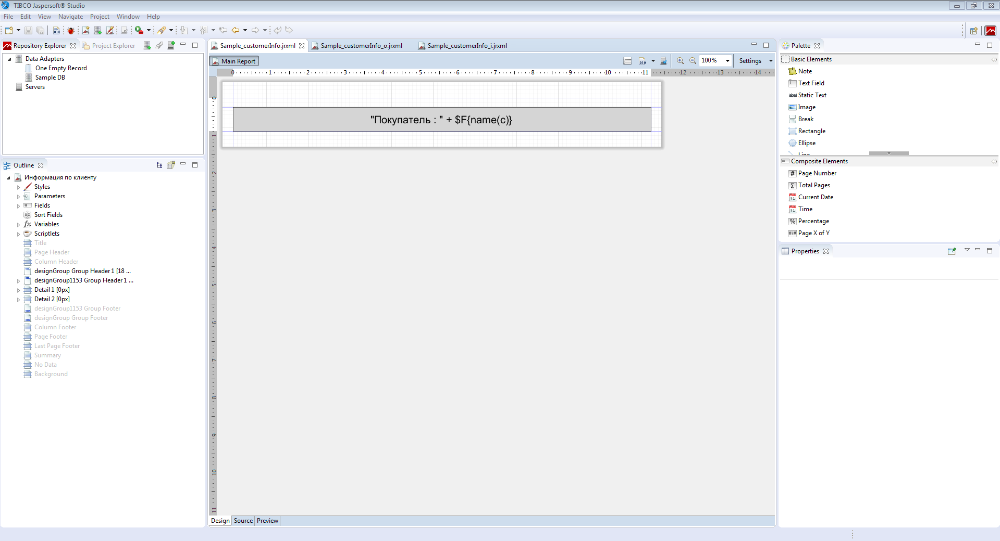
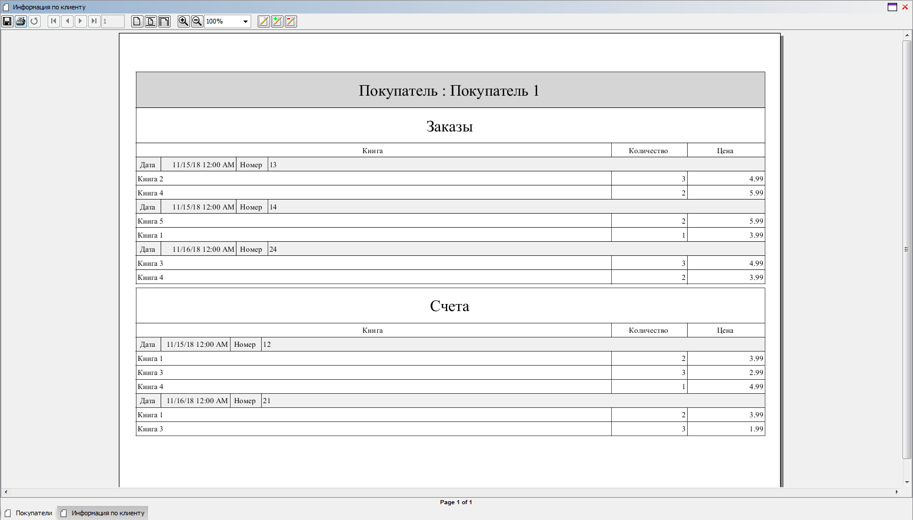

# lsFusionHow-to: Reports

# How-to: Reports

##### Example 1

###### Condition

We have a logic for books split into categories.

The principle of this report is that objects with invoices and orders are independent of each other. Thus, they will be generated as different subreports (**Subreport**).

Since the dependency between objects forms a tree with two leaf nodes, a total of three templates will be formed:

1.  *Sample\_customerInfo* is a top report that will show buyer data (in this case, for a single buyer). It will contain links to subreports *Sample\_customerInfo\_i* and *Sample\_customerInfo\_o*.  
    

    **Template: Sample\_customerInfo.jrxml**
     Expand source

        <?xml version="1.0" encoding="UTF-8"?>
        <!-- Created with Jaspersoft Studio version 6.6.0.final using JasperReports Library version 6.6.0  -->
        <jasperReport xmlns="http://jasperreports.sourceforge.net/jasperreports" xmlns:xsi="http://www.w3.org/2001/XMLSchema-instance" xsi:schemaLocation="http://jasperreports.sourceforge.net/jasperreports http://jasperreports.sourceforge.net/xsd/jasperreport.xsd" name="Информация по клиенту" pageWidth="842" pageHeight="595" orientation="Landscape" columnWidth="555" leftMargin="20" rightMargin="20" topMargin="30" bottomMargin="30" uuid="06ed2f8a-ff5b-497a-925f-5a8722df2e57">
            
            
            
            <parameter name="o_report" class="net.sf.jasperreports.engine.JasperReport"/>
            <parameter name="o_source" class="net.sf.jasperreports.engine.JRDataSource"/>
            <parameter name="o_params" class="java.util.Map"/>
            <parameter name="i_report" class="net.sf.jasperreports.engine.JasperReport"/>
            <parameter name="i_source" class="net.sf.jasperreports.engine.JRDataSource"/>
            <parameter name="i_params" class="java.util.Map"/>
            <field name="c.object" class="java.lang.Long"/>
            <field name="name(c)" class="java.lang.String"/>
            <group name="designGroup">
                <groupExpression><![CDATA[]]></groupExpression>\n\t\t<groupHeader>\n\t\t\t<band height="18" splitType="Prevent"/>\n\t\t</groupHeader>\n\t</group>\n\t<group name="designGroup1153">\n\t\t<groupExpression><![CDATA[String.valueOf($F{c.object})]]></groupExpression>\n\t\t<groupHeader>\n\t\t\t<band height="46" splitType="Prevent">\n\t\t\t\t<textField isStretchWithOverflow="true" isBlankWhenNull="true">\n\t\t\t\t\t<reportElement style="GroupCellStyle2" positionType="Float" stretchType="RelativeToBandHeight" x="0" y="0" width="802" height="46" uuid="dacafbf4-9be5-4748-b8e7-c01b1e4d98ab"/>\n\t\t\t\t\t<textElement textAlignment="Center">\n\t\t\t\t\t\t\n\t\t\t\t\t</textElement>\n\t\t\t\t\t<textFieldExpression><![CDATA["Customer : " + $F{name(c)}]]></textFieldExpression>\n\t\t\t\t</textField>\n\t\t\t</band>\n\t\t</groupHeader>\n\t</group>\n\t<detail>\n\t\t<band>\n\t\t\t<subreport>\n\t\t\t\t<reportElement stretchType="RelativeToBandHeight" x="0" y="0" width="0" height="0" uuid="9a51a576-f72c-4ccc-bb2c-95966743b540"/>\n\t\t\t\t<parametersMapExpression><![CDATA[$P{o_params}]]></parametersMapExpression>\n\t\t\t\t<dataSourceExpression><![CDATA[$P{o_source}]]></dataSourceExpression>\n\t\t\t\t<subreportExpression><![CDATA[$P{o_report}]]></subreportExpression>\n\t\t\t</subreport>\n\t\t</band>\n\t\t<band>\n\t\t\t<subreport>\n\t\t\t\t<reportElement stretchType="RelativeToBandHeight" x="0" y="0" width="0" height="0" uuid="4d75be9a-a015-4b45-9ac8-bf383332dd2a"/>\n\t\t\t\t<parametersMapExpression><![CDATA[$P{i_params}]]></parametersMapExpression>\n\t\t\t\t<dataSourceExpression><![CDATA[$P{i_source}]]></dataSourceExpression>\n\t\t\t\t<subreportExpression><![CDATA[$P{i_report}]]></subreportExpression>\n\t\t\t</subreport>\n\t\t</band>\n\t</detail>\n</jasperReport>\n

2.  *Sample\_customerInfo\_o* is a report that will contain all the orders along with their lines.

    **Template: Sample\_customerInfo\_o.jrxml**
     Expand source

        <?xml version="1.0" encoding="UTF-8"?>
        <!-- Created with Jaspersoft Studio version 6.6.0.final using JasperReports Library version 6.6.0  -->
        <jasperReport xmlns="http://jasperreports.sourceforge.net/jasperreports" xmlns:xsi="http://www.w3.org/2001/XMLSchema-instance" xsi:schemaLocation="http://jasperreports.sourceforge.net/jasperreports http://jasperreports.sourceforge.net/xsd/jasperreport.xsd" name="o" pageWidth="842" pageHeight="595" orientation="Landscape" columnWidth="555" leftMargin="0" rightMargin="0" topMargin="0" bottomMargin="0" uuid="b5fa21a2-3583-4e69-9766-70ddacc9af1f">
            
            
            
            <field name="o.object" class="java.lang.Long"/>
            <field name="date(o)" class="java.util.Date"/>
            <field name="number(o)" class="java.lang.String"/>
            <field name="od.object" class="java.lang.Long"/>
            <field name="nameBook(od)" class="java.lang.String"/>
            <field name="quantity(od)" class="java.lang.Integer"/>
            <field name="price(od)" class="java.math.BigDecimal"/>
            <group name="designGroup1560">
                <groupExpression><![CDATA[String.valueOf($F{o.object})]]></groupExpression>\n\t\t<groupHeader>\n\t\t\t<band height="18" splitType="Prevent">\n\t\t\t\t<textField isStretchWithOverflow="true">\n\t\t\t\t\t<reportElement style="GroupCellStyle0" stretchType="RelativeToBandHeight" x="0" y="0" width="32" height="18" uuid="7a140661-f62c-48e3-a050-2667b8215684"/>\n\t\t\t\t\t<textElement textAlignment="Center"/>\n\t\t\t\t\t<textFieldExpression><![CDATA["Date"]]></textFieldExpression>\n\t\t\t\t</textField>\n\t\t\t\t<textField isStretchWithOverflow="true" isBlankWhenNull="true">\n\t\t\t\t\t<reportElement style="GroupCellStyle0" positionType="Float" stretchType="RelativeToBandHeight" x="32" y="0" width="96" height="18" uuid="0764778b-b7e8-47af-9bb1-f8e8c0b3a50a"/>\n\t\t\t\t\t<textElement textAlignment="Right"/>\n\t\t\t\t\t<textFieldExpression><![CDATA[$F{date(o)}]]></textFieldExpression>\n\t\t\t\t</textField>\n\t\t\t\t<textField isStretchWithOverflow="true">\n\t\t\t\t\t<reportElement style="GroupCellStyle0" stretchType="RelativeToBandHeight" x="128" y="0" width="40" height="18" uuid="9d4386c3-8b68-4d22-9a57-72a1b9f4edb0"/>\n\t\t\t\t\t<textElement textAlignment="Center"/>\n\t\t\t\t\t<textFieldExpression><![CDATA["ID"]]></textFieldExpression>\n\t\t\t\t</textField>\n\t\t\t\t<textField isStretchWithOverflow="true" isBlankWhenNull="true">\n\t\t\t\t\t<reportElement style="GroupCellStyle0" positionType="Float" stretchType="RelativeToBandHeight" x="168" y="0" width="634" height="18" uuid="bcc4aee3-1e1a-4373-bc23-2c71a5193277"/>\n\t\t\t\t\t<textElement textAlignment="Left"/>\n\t\t\t\t\t<textFieldExpression><![CDATA[$F{number(o)}]]></textFieldExpression>\n\t\t\t\t</textField>\n\t\t\t</band>\n\t\t</groupHeader>\n\t</group>\n\t<title>\n\t\t<band height="45">\n\t\t\t<staticText>\n\t\t\t\t<reportElement x="0" y="0" width="802" height="45" uuid="bedb580c-7ea1-4962-b012-273c455d18db"/>\n\t\t\t\t<textElement textAlignment="Center">\n\t\t\t\t\t\n\t\t\t\t</textElement>\n\t\t\t\t<text><![CDATA[Orders]]></text>\n\t\t\t</staticText>\n\t\t</band>\n\t</title>\n\t<pageHeader>\n\t\t<band height="18">\n\t\t\t<textField isStretchWithOverflow="true">\n\t\t\t\t<reportElement style="GroupCellStyle1" stretchType="RelativeToBandHeight" x="0" y="0" width="606" height="18" uuid="2ed4a155-b17f-4c87-93bb-ccb3c17f99d6"/>\n\t\t\t\t<textElement textAlignment="Center"/>\n\t\t\t\t<textFieldExpression><![CDATA["Book"]]></textFieldExpression>\n\t\t\t</textField>\n\t\t\t<textField isStretchWithOverflow="true">\n\t\t\t\t<reportElement style="GroupCellStyle1" stretchType="RelativeToBandHeight" x="606" y="0" width="97" height="18" uuid="55aeb106-a5f3-42ac-a43f-571457fc26c8"/>\n\t\t\t\t<textElement textAlignment="Center"/>\n\t\t\t\t<textFieldExpression><![CDATA["Quantity"]]></textFieldExpression>\n\t\t\t</textField>\n\t\t\t<textField isStretchWithOverflow="true">\n\t\t\t\t<reportElement style="GroupCellStyle1" stretchType="RelativeToBandHeight" x="703" y="0" width="99" height="18" uuid="186d6da9-1a7a-49e8-b7a4-6df9dcec61e6"/>\n\t\t\t\t<textElement textAlignment="Center"/>\n\t\t\t\t<textFieldExpression><![CDATA["Price"]]></textFieldExpression>\n\t\t\t</textField>\n\t\t</band>\n\t</pageHeader>\n\t<detail>\n\t\t<band height="18">\n\t\t\t<textField isStretchWithOverflow="true" isBlankWhenNull="true">\n\t\t\t\t<reportElement style="GroupCellStyle1" positionType="Float" stretchType="RelativeToBandHeight" x="0" y="0" width="606" height="18" uuid="4161551d-97d3-48d5-a26a-11b0a145f131"/>\n\t\t\t\t<textElement textAlignment="Left"/>\n\t\t\t\t<textFieldExpression><![CDATA[$F{nameBook(od)}]]></textFieldExpression>\n\t\t\t</textField>\n\t\t\t<textField isStretchWithOverflow="true" isBlankWhenNull="true">\n\t\t\t\t<reportElement style="GroupCellStyle1" positionType="Float" stretchType="RelativeToBandHeight" x="606" y="0" width="97" height="18" uuid="8739e7c6-7536-4ff4-93a0-4dfe576a376e"/>\n\t\t\t\t<textElement textAlignment="Right"/>\n\t\t\t\t<textFieldExpression><![CDATA[$F{quantity(od)}]]></textFieldExpression>\n\t\t\t</textField>\n\t\t\t<textField isStretchWithOverflow="true" isBlankWhenNull="true">\n\t\t\t\t<reportElement style="GroupCellStyle1" positionType="Float" stretchType="RelativeToBandHeight" x="703" y="0" width="99" height="18" uuid="345899e3-a8b5-4532-b8e5-ddadf1ca95b5"/>\n\t\t\t\t<textElement textAlignment="Right"/>\n\t\t\t\t<textFieldExpression><![CDATA[$F{price(od)}]]></textFieldExpression>\n\t\t\t</textField>\n\t\t</band>\n\t</detail>\n</jasperReport>\n

3.  *Sample\_customerInfo\_i * is a report that will contain all the invoices with their lines.

    **Template: Sample\_customerInfo\_i.jrxml**
     Expand source

        <?xml version="1.0" encoding="UTF-8"?>
        <!-- Created with Jaspersoft Studio version 6.6.0.final using JasperReports Library version 6.6.0  -->
        <jasperReport xmlns="http://jasperreports.sourceforge.net/jasperreports" xmlns:xsi="http://www.w3.org/2001/XMLSchema-instance" xsi:schemaLocation="http://jasperreports.sourceforge.net/jasperreports http://jasperreports.sourceforge.net/xsd/jasperreport.xsd" name="i" pageWidth="842" pageHeight="595" orientation="Landscape" columnWidth="555" leftMargin="0" rightMargin="0" topMargin="5" bottomMargin="0" uuid="82cf7f76-d161-47d0-a5eb-7c4c08a08c5f">
            
            
            
            <field name="i.object" class="java.lang.Long"/>
            <field name="date(i)" class="java.util.Date"/>
            <field name="number(i)" class="java.lang.String"/>
            <field name="id.object" class="java.lang.Long"/>
            <field name="nameBook(id)" class="java.lang.String"/>
            <field name="quantity(id)" class="java.lang.Integer"/>
            <field name="price(id)" class="java.math.BigDecimal"/>
            <group name="designGroup1591">
                <groupExpression><![CDATA[String.valueOf($F{i.object})]]></groupExpression>\n\t\t<groupHeader>\n\t\t\t<band height="18" splitType="Prevent">\n\t\t\t\t<textField isStretchWithOverflow="true">\n\t\t\t\t\t<reportElement style="GroupCellStyle0" stretchType="RelativeToBandHeight" x="0" y="0" width="32" height="18" uuid="f4d356be-24a9-4ca9-851f-167c95ffc33c"/>\n\t\t\t\t\t<textElement textAlignment="Center"/>\n\t\t\t\t\t<textFieldExpression><![CDATA["Date"]]></textFieldExpression>\n\t\t\t\t</textField>\n\t\t\t\t<textField isStretchWithOverflow="true" isBlankWhenNull="true">\n\t\t\t\t\t<reportElement style="GroupCellStyle0" positionType="Float" stretchType="RelativeToBandHeight" x="32" y="0" width="88" height="18" uuid="97cebc8a-8bdd-4c8f-b90e-0dd3bcb6c4b1"/>\n\t\t\t\t\t<textElement textAlignment="Right"/>\n\t\t\t\t\t<textFieldExpression><![CDATA[$F{date(i)}]]></textFieldExpression>\n\t\t\t\t</textField>\n\t\t\t\t<textField isStretchWithOverflow="true">\n\t\t\t\t\t<reportElement style="GroupCellStyle0" stretchType="RelativeToBandHeight" x="120" y="0" width="40" height="18" uuid="3098f851-ca96-45b9-9cf2-04e6e243528a"/>\n\t\t\t\t\t<textElement textAlignment="Center"/>\n\t\t\t\t\t<textFieldExpression><![CDATA["ID"]]></textFieldExpression>\n\t\t\t\t</textField>\n\t\t\t\t<textField isStretchWithOverflow="true" isBlankWhenNull="true">\n\t\t\t\t\t<reportElement style="GroupCellStyle0" positionType="Float" stretchType="RelativeToBandHeight" x="160" y="0" width="642" height="18" uuid="71a8d3eb-c29f-4363-a1e6-857af2784d5a"/>\n\t\t\t\t\t<textElement textAlignment="Left"/>\n\t\t\t\t\t<textFieldExpression><![CDATA[$F{number(i)}]]></textFieldExpression>\n\t\t\t\t</textField>\n\t\t\t</band>\n\t\t</groupHeader>\n\t</group>\n\t<title>\n\t\t<band height="45">\n\t\t\t<staticText>\n\t\t\t\t<reportElement x="0" y="0" width="802" height="45" uuid="ec3d75be-ea13-4ee3-a0f0-22e7612fe552"/>\n\t\t\t\t<textElement textAlignment="Center">\n\t\t\t\t\t\n\t\t\t\t</textElement>\n\t\t\t\t<text><![CDATA[Invoices]]></text>\n\t\t\t</staticText>\n\t\t</band>\n\t</title>\n\t<pageHeader>\n\t\t<band height="18">\n\t\t\t<textField isStretchWithOverflow="true">\n\t\t\t\t<reportElement style="GroupCellStyle1" stretchType="RelativeToBandHeight" x="0" y="0" width="606" height="18" uuid="768f5aa5-7a86-49aa-9c18-855e4e4d3d02"/>\n\t\t\t\t<textElement textAlignment="Center"/>\n\t\t\t\t<textFieldExpression><![CDATA["Book"]]></textFieldExpression>\n\t\t\t</textField>\n\t\t\t<textField isStretchWithOverflow="true">\n\t\t\t\t<reportElement style="GroupCellStyle1" stretchType="RelativeToBandHeight" x="606" y="0" width="97" height="18" uuid="032b4dad-5895-46e1-ba97-7e2af9ebecde"/>\n\t\t\t\t<textElement textAlignment="Center"/>\n\t\t\t\t<textFieldExpression><![CDATA["Quantity"]]></textFieldExpression>\n\t\t\t</textField>\n\t\t\t<textField isStretchWithOverflow="true">\n\t\t\t\t<reportElement style="GroupCellStyle1" stretchType="RelativeToBandHeight" x="703" y="0" width="99" height="18" uuid="092947c2-bbd0-464f-8048-4d800c05a6c6"/>\n\t\t\t\t<textElement textAlignment="Center"/>\n\t\t\t\t<textFieldExpression><![CDATA["Price"]]></textFieldExpression>\n\t\t\t</textField>\n\t\t</band>\n\t</pageHeader>\n\t<detail>\n\t\t<band height="18">\n\t\t\t<textField isStretchWithOverflow="true" isBlankWhenNull="true">\n\t\t\t\t<reportElement style="GroupCellStyle1" positionType="Float" stretchType="RelativeToBandHeight" x="0" y="0" width="606" height="18" uuid="86fa4116-b7e3-4aaf-a284-45a596a52f2b"/>\n\t\t\t\t<textElement textAlignment="Left"/>\n\t\t\t\t<textFieldExpression><![CDATA[$F{nameBook(id)}]]></textFieldExpression>\n\t\t\t</textField>\n\t\t\t<textField isStretchWithOverflow="true" isBlankWhenNull="true">\n\t\t\t\t<reportElement style="GroupCellStyle1" positionType="Float" stretchType="RelativeToBandHeight" x="606" y="0" width="97" height="18" uuid="0c6acbce-c5ad-450f-a0be-23aa4b7e2ad0"/>\n\t\t\t\t<textElement textAlignment="Right"/>\n\t\t\t\t<textFieldExpression><![CDATA[$F{quantity(id)}]]></textFieldExpression>\n\t\t\t</textField>\n\t\t\t<textField isStretchWithOverflow="true" isBlankWhenNull="true">\n\t\t\t\t<reportElement style="GroupCellStyle1" positionType="Float" stretchType="RelativeToBandHeight" x="703" y="0" width="99" height="18" uuid="7b44de1a-3656-43b5-904a-fee48f5fc245"/>\n\t\t\t\t<textElement textAlignment="Right"/>\n\t\t\t\t<textFieldExpression><![CDATA[$F{price(id)}]]></textFieldExpression>\n\t\t\t</textField>\n\t\t</band>\n\t</detail>\n</jasperReport>

The result of this slightly modified report will look like this:

