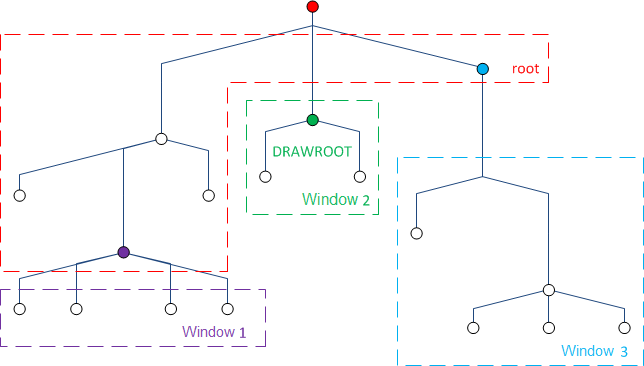

# lsFusionNavigator design

# Navigator design

*Navigator design* determines how the navigator  is displayed to the user on the screen of his device (we will call the screen space on which the navigator is displayed the *desktop*).

The navigator design consists of multiple *windows*, desktop components,* *each of which displays certain [navigator&nbsp;](Navigator.md)elements. 

Each window must have a *caption* which will be used when displaying the window in the user interface.

**Navigator elements layout in windows**

For each navigator element, you can specify the window in which its descendants should be displayed. If necessary, the element itself can be displayed there. Thus, the set of *subtrees* (navigator *elements*) that is displayed in each window is uniquely determined. Graphically, this can be represented as follows:

**Window layout on the desktop**

Each window occupies a predefined section of the desktop. Graphically, this can be represented as follows:

  
