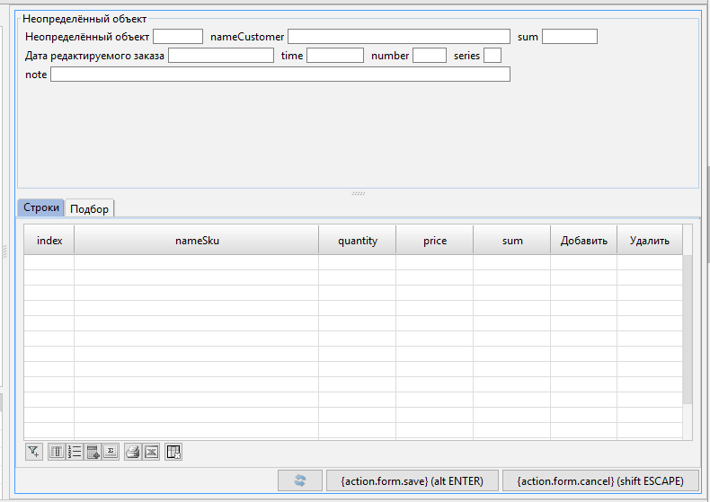

# lsFusionDESIGN instruction

# DESIGN instruction

The **DESIGN** instruction changes [form design](lsFusionForm_design.md).

**Syntax**

The syntax consists of nested blocks of *design instructions.* The outer block, beginning with the keyword **DESIGN**, defines a [form](lsFusionForms.md) whose design will change: 

    DESIGN formName [caption] [CUSTOM] {
        designStatement1
        ...
        designStatementN
    }

Each  *designStatement * describes one design instruction. Design instructions are of the following types: 

    NEW name [insertPos] [{...}];
    MOVE selector [insertPos] [{...}];  
    selector [{...}];   
    REMOVE selector;
    propertyName = value;

The first three instructions – *create* (**NEW**), *move* (**MOVE**), and *modify *– may in turn contain nested blocks of design instructions. The design instructions *remove* (**REMOVE**) and *change property value* (**=**) are simple single instructions. Each navigator instruction must end with a semicolon if it does not contain a nested instruction block.

Each *selector* can be one of the following types:

    componentName
    PROPERTY(formPropertyName)
    FILTERGROUP(filterGroupName)
    PARENT(selector)
    GROUP([propertyGroupSelector][,groupObjectTreeSelector])
    noGroupObjectTreeContainerType
    groupObjectTreeContainerType(groupObjectTreeSelector)

In turn, *groupObjectTreeSelector* can be one of two types:

    groupObjectSelector
    TREE treeSelector

**Description**

Using the **DESIGN** instruction the developer can manage the [design](lsFusionForm_design.md) [of the](lsFusionInteractive_view.md) interactive form view by creating, moving, and deleting containers and components, as well as changing their certain properties. By default, a [default design](Form-design_29884443.html#Formdesign-defaultDesign)  is created for each form, along with appropriate containers. If necessary, you can recreate the design without the default containers and previously configured settings. This is done using the keyword **CUSTOM**.  

Each block of design instructions enclosed in braces alows to modify a particular component and its descendants. Let's call this component the *current component* or the *current container* if we know that the component should be a container in our case. In the external block following the  **DESIGN **keyword, the **main** container is the current component. There are the following design instructions:

-   The *create instruction* (**NEW**) allows to create a new container, making it a descendant of the current one. The newly-created container will be the current component in the design instructions block contained in this instruction.
-   The *move instruction* (**MOVE**)  allows to make an existing component a direct descendant of the current container. This component is first removed from the previous parent container. The component being moved becomes the current component in the design instructions block contained in this instruction. 
-   The *modify* instruction allows to modify the specified component which must be a descendant (not necessarily a child) of the current container. The specified element will be the current component in the design instructions block contained in this instruction.
-   The *remove instruction*(**REMOVE**) allows to remove a specified component from the component hierarchy. The component to be removed has to be a descendant of the current container. 
-   The *change property value instruction*(**=**) allows to change the value of the specified property of the current component.

The component hierarchy described in this instruction can have an arbitrary number of nesting levels and describe any number of components and their properties at each level.

To access design components, you can use their names or address property components on the form (**PROPERTY**), the parent component (**PARENT**), property group components (**GROUP**), and other base components/default design components.

**Parameters**

***Common parameters***

*formName*

The name of the form being changed. [Composite ID](IDs_1573053.html#IDs-cid).* *

*caption*

The new form caption in the interactive view mode. [String literal](Literals_35521071.html#Literals-strliteral). The form caption doesn't change in the [navigator](lsFusionNavigator.md).

*name*

The name of the container being created. [Simple ID](IDs_1573053.html#IDs-id).

*insertPos*

Component insertion or moving position. Specified with one of the following options:*  
*

**BEFORE** selector

**AFTER** selector 

Specifies that the component should be added or moved before (**BEFORE**) or after (**AFTER**) the specified components. The specified component must be a child of the current container. 

**FIRST**

A keyword specifying that the component should be added or moved to the first position in the list of the current container's children. 

*propertyName*

The name of the component property. The list of existing properties is provided in the tables below.

*value*

The value assigned to the corresponding container property. Acceptable value types are provided in the tables below.

***Component properties***

The output is the following form:

