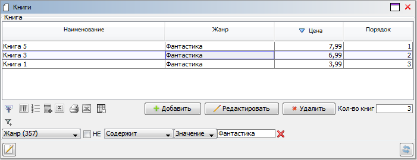

# lsFusionHow-to: Table status

# How-to: Table status

##### Example 1

###### Condition

We have the concept of books, for which title, genre and price are defined.

The property with the current order, defined using the [ORDER](lsFusionOrder_ORDER_.md) operator, is not declared as a separate named property but is used directly in the expression.

The form obtained in both examples, with user-defined filter and order, will look like this:

