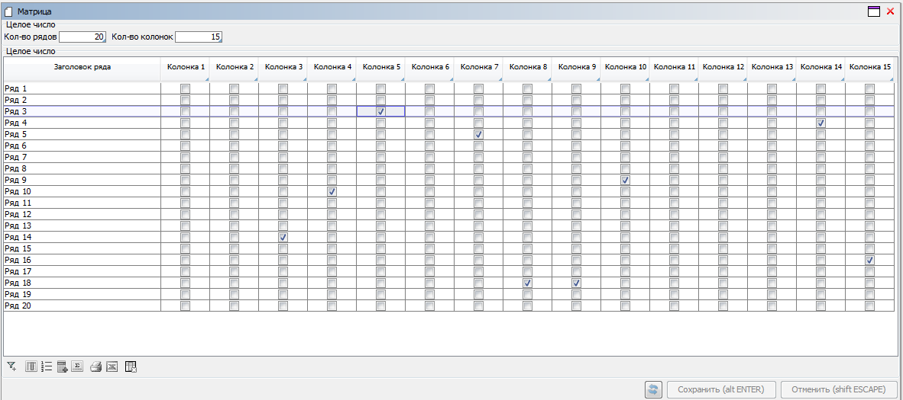

## Пример 1

### Условие

Заданы понятия книг и покупателей. Для каждой книги и покупателя задается своя цена.

import {CodeSample} from './CodeSample.mdx'

<CodeSample url="https://ru-documentation.lsfusion.org/sample?file=UseCaseColumns&block=sample1"/>

Нужно построить форму с единственной таблицей, в которой в строках будут книги, а в колонках - покупатели. В каждой ячейке должна быть цена для данной книги и покупателя.

### Решение

<CodeSample url="https://ru-documentation.lsfusion.org/sample?file=UseCaseColumns&block=solution1"/>

Объект **c** не будет отображаться на форме, так как для него не добавлено ни одного свойства.

Форма будет выглядеть следующим образом :

## Пример 2

### Условие

Аналогично **Примеру 1**, только для книги и покупателя также задается отсрочка платежа в днях.

<CodeSample url="https://ru-documentation.lsfusion.org/sample?file=UseCaseColumns&block=sample2"/>

Нужно построить форму с единственной таблицей, в которой в строках будут книги, а в колонках - покупатели. При этом для каждого покупателя должно быть две колонки рядом : цена и отсрочка. Колонки с отсрочкой нужно выделить желтым цветом. Должна быть возможность выбирать каких покупателей отображать в колонки.

### Решение

<CodeSample url="https://ru-documentation.lsfusion.org/sample?file=UseCaseColumns&block=solution2"/>

В колонки будут показываться только те объекты, которые попадают в фильтр для объекта **c**. Кроме того, колонки будут идти в том же порядке, что и объекты.

Все свойства с одинаковым идентификатором после слова **COLUMNS** будут идти рядом для одних и тех же объектов. В данном случае, цена и отсрочка для первого покупателя, затем цена и отсрочка для второго и так далее. Если идентификаторы были бы разными или не указаны во все, то сначала бы шли цены для всех покупателей, а потом уже отсрочки.

Форма будет выглядеть следующим образом :

## Пример 3

### Условие

Нужно построить форму, в которой будет матрица с задаваемым количеством рядов и колонок. Пользователь должен иметь возможность проставлять в каждой ячейке отметку.

### Решение

<CodeSample url="https://ru-documentation.lsfusion.org/sample?file=UseCaseColumns&block=solution3"/>

В рабочих проектах лучше ограничивать количество рядов и колонок при вводе или фильтрации. Иначе, если пользователь введет очень большое количество строк или столбцов для свойства **iterate** будет сформирован CTE запрос с таблицей на это количество записей, что может привести к падению сервера базы данных.

Результат :

